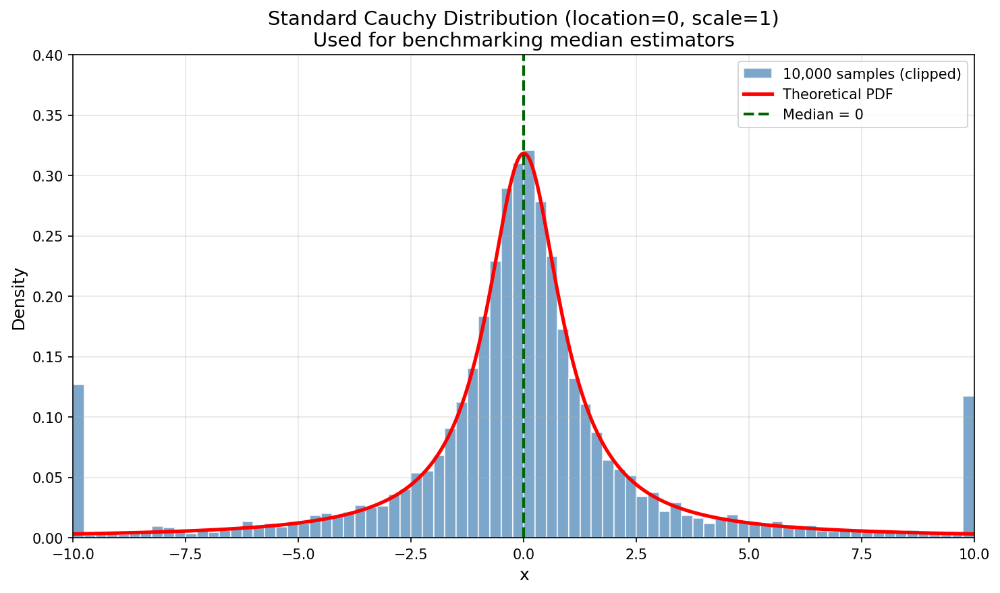
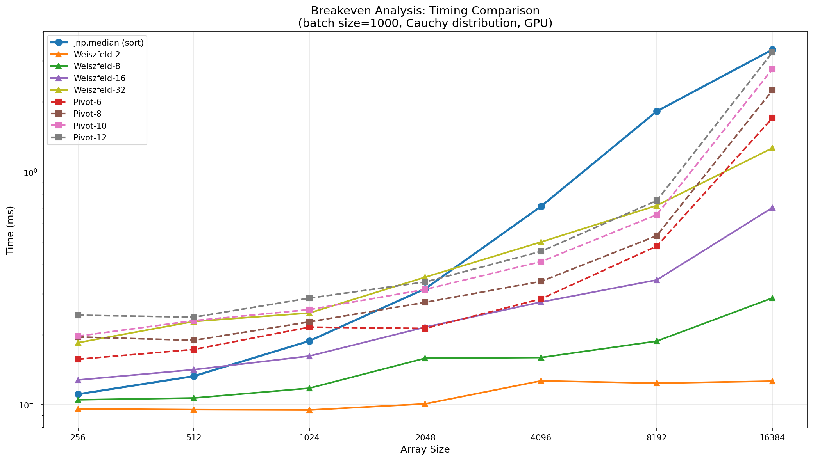
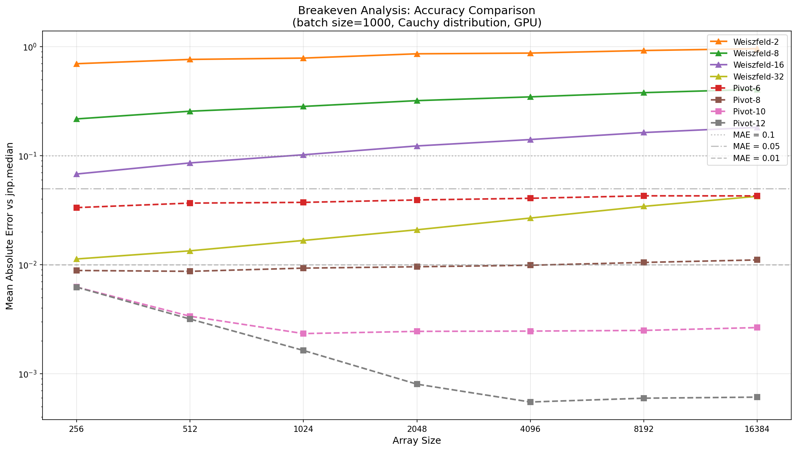
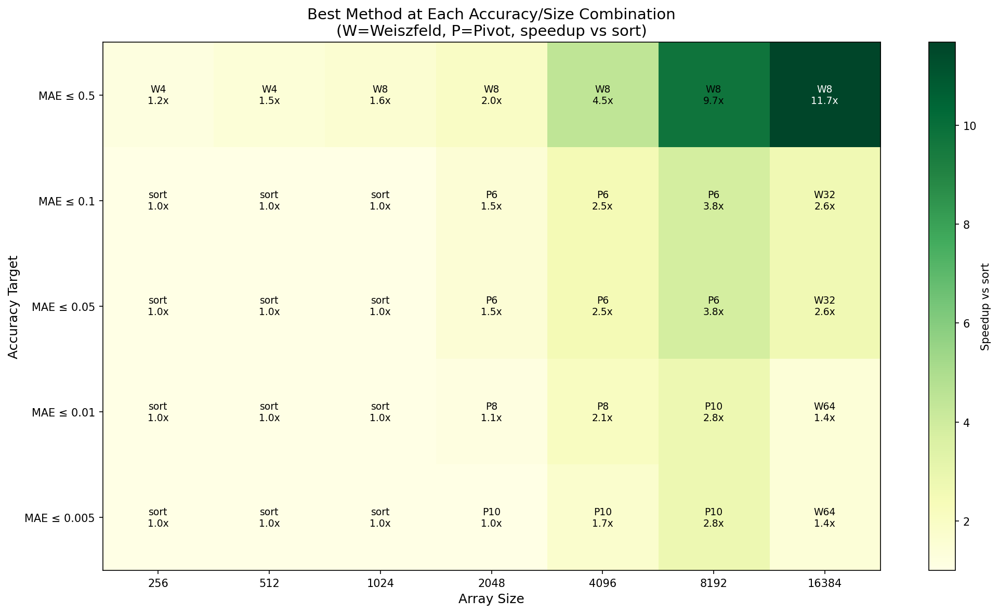
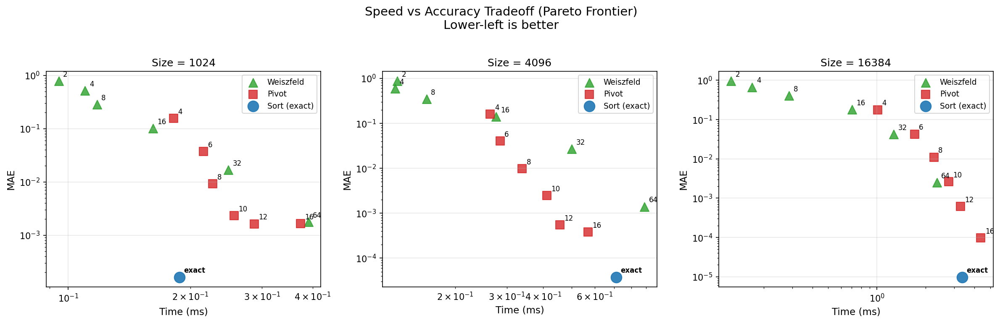

# JAX Median Estimation

Computing the median is surprisingly expensive on JAX on GPUs. This repo benchmarks alternative approaches.

## Algorithms

### Sorting

The JAX standard library sorts the array and takes the middle element. This is **O(N log N)**—acceptable for small arrays, but expensive at scale:

```python
# What jnp.median does internally (simplified)
def median_via_sort(x):
    sorted_x = jnp.sort(x)  # O(n log n)
    n = len(x)
    return sorted_x[n // 2]
```

Sorting is inherently sequential in nature. While sorting is well tuned for GPUs, they still require O(log N) synchronization steps, each touching all elements.

### Quickselect

On CPUs, the textbook solution is an O(N) expected-time algorithm that partitions data around pivots:

```
QUICKSELECT(arr, k):
    pivot = choose_pivot(arr)
    less    = [x for x in arr if x < pivot]
    equal   = [x for x in arr if x == pivot]
    greater = [x for x in arr if x > pivot]

    if k < len(less):
        return QUICKSELECT(less, k)
    elif k < len(less) + len(equal):
        return pivot
    else:
        return QUICKSELECT(greater, k - len(less) - len(equal))
```

Each iteration physically redistributes data based on comparison results. This creates data-dependent memory access 
patterns (cache unfriendly) and sequential dependency between iterations (can't parallelize)

### The Weiszfeld Algorithm

The smoothed Weiszfeld algorithm takes a completely different approach.  It iteratively refines an estimate using weighted averaging:

```python
def weiszfeld(x, nu=1e-6, iters=10):
    mu = jnp.mean(x)
    for _ in range(iters):
        diff = x - mu
        weights = 1.0 / jnp.sqrt(diff**2 + nu**2)
        mu = jnp.sum(weights * x) / jnp.sum(weights)
    return mu
```

This is a modification of "classic" Weiszfeld which has a problem with the weights going to infinity.

This is more GPU-friendly due to:
- **Fixed memory access pattern** (same elements every iteration)
- **Fully vectorizable** (all operations are element-wise or reductions)
- **No data movement** between iterations

Note that even a dot product is an O(log N) cost on the GPU due to the reduce, but is highly optimized.

The tradeoff here is that the median estimate improves accuracy with more iterations.

---

## Benchmark Setup



We benchmark on Cauchy-distributed data, a pathological distribution with heavy tails and no defined mean. The Cauchy distribution has a well-defined median (the location parameter = 0), making it ideal for testing robust estimators.

**Configuration:**
- **Hardware**: NVIDIA RTX 4080 Super GPU
- **Data**: Standard Cauchy distribution (location=0, scale=1)
- **Batch size**: 1000 independent samples
- **Array sizes**: 256, 512, 1024, 2048, 4096, 8192, 16384
- **Timing**: 50 runs after JIT warm-up

---

## Algorithm Implementations

### 1. Sort-based (jnp.median)

```python
@jax.vmap
def batched_median(x):
    return jnp.median(x)  # Uses sorting internally
```

### 2. Smoothed Weiszfeld

```python
@partial(jax.vmap, in_axes=0)
def weiszfeld(x, nu=1e-6, iters=16):
    mu = jnp.mean(x)
    for _ in range(iters):
        diff = x - mu
        weights = 1.0 / jnp.sqrt(diff**2 + nu**2)
        mu = jnp.sum(weights * x) / jnp.sum(weights)
    return mu
```

### 3. Pivot-based (GPU quickselect)

A GPU-friendly quickselect that uses masks instead of physical partitioning.  Here is the NaN tolerant version:

```python
@partial(jax.vmap, in_axes=0)
def pivot_median(x, iters=16):
    n = x.shape[0]
    target = (n - 1) // 2
    active = jnp.ones(n, dtype=bool)
    low_count = 0

    for _ in range(iters):
        pivot = jnp.nanmean(jnp.where(active, x, jnp.nan))

        less_mask = active & (x < pivot)
        equal_mask = active & (x == pivot)
        greater_mask = active & (x > pivot)

        n_less = jnp.sum(less_mask)
        n_equal = jnp.sum(equal_mask)
        adjusted_target = target - low_count

        # Select partition containing median
        in_less = adjusted_target < n_less
        in_equal = (adjusted_target >= n_less) & (adjusted_target < n_less + n_equal)

        active = jnp.where(in_less, less_mask,
                          jnp.where(in_equal, equal_mask, greater_mask))
        low_count = jnp.where(adjusted_target >= n_less + n_equal,
                             low_count + n_less + n_equal, low_count)

    return jnp.nanmean(jnp.where(active, x, jnp.nan))
```

### 4. NaN-aware Weiszfeld

```python
def nan_weiszfeld(x, nu=1e-6, iters=16):
    nan_mask = jnp.isnan(x)
    x_safe = jnp.where(nan_mask, 0.0, x)
    mu = jnp.nanmean(x)
    for _ in range(iters):
        diff = x_safe - mu
        raw_weights = 1.0 / jnp.sqrt(diff**2 + nu**2)
        weights = jnp.where(nan_mask, 0.0, raw_weights)
        mu = jnp.sum(weights * x_safe) / jnp.sum(weights)
    return mu
```

**Why `x_safe`?** In IEEE 754, `NaN * 0.0 = NaN`. Even with zero weight, NaN values would poison the sum.

---

## Results: GPU Timing (batch=1000)



---

## Results: Accuracy



---

## Breakeven Points by Accuracy Target



---

## Speed vs Accuracy Tradeoff



---

## Conclusions

- For small inputs, the default highly tuned sort is fine with no downside.

- If performance is more important than accuracy, Weiszfeld wins.

- For very large sizes, Weiszfeld wins because the large input size
  improves accuracy anyway.

- Modest performance improvement can be gained by using quickselect-like techniques before the others,
  but it is modest.

- I didn't examine other well known alternatives like median-of-medians or random sampling.


---

## Running the Benchmarks

```bash
python3 -m venv venv
source venv/bin/activate
pip install "jax[cuda12]" matplotlib scipy

python benchmark_breakeven.py
python plot_breakeven.py
```

---

## References

- Pillutla, K., Kakade, S. M., & Harchaoui, Z. (2022). [Robust Aggregation for Federated Learning](https://arxiv.org/abs/1912.13445). *IEEE Transactions on Signal Processing*, 70, 1142-1154. ([GitHub](https://github.com/krishnap25/RFA))
- Cohen, M. B., Lee, Y. T., Miller, G., Pachocki, J., & Sidford, A. (2016). [Geometric Median in Nearly Linear Time](https://arxiv.org/abs/1606.05225). *STOC 2016*.
